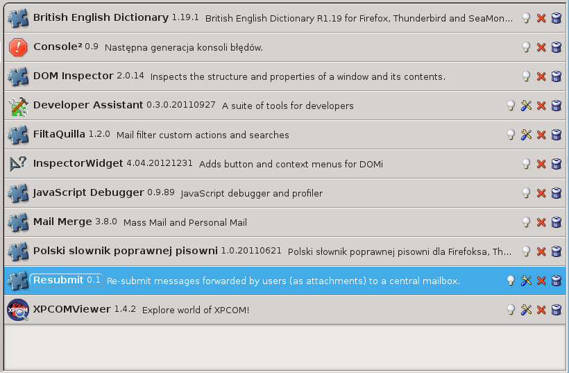
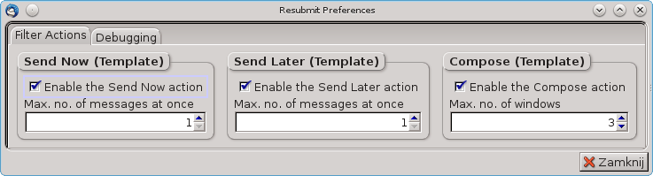
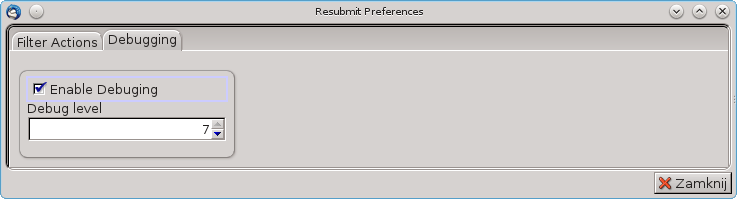

Resubmit
========

Simple Thunderbird add-on for every-day re-submission of messages received from
multiple senders.

Overwiev
--------

This tool is designated for network/mail administrators. Having a bunch of
messages forwarded to you by your users, the **Resubmit** tool extracts all
attached messages from these emails, then for each extracted message it
composes a **new** message with the extracted message attached to it and sends
the **new** message  to a specified recipient(s). It's particularly useful as
a tool for supervised spam/ham sample resubmission.

Motivation
----------

The following was a motivating use case for the **Resubmit** add-on.

My users send me spam samples (missed spam and false positives) and I
have to resubmit it to McAfee. According to their article `Best Practices -
Submitting spam samples to McAfee`_, the samples should be included as
attachments into **new** messages. The emails with samples should originate
from a customer address (e.g. *admin@example.com*) known to McAfee.

So, this is basically job for a tool such as **Resubmit** add-on.

More details
------------

The extension defines three new filter actions, which may be used to create
custom filters for resubmission. The filter actions are:

- **Resubmit - Send Now (Template)**,
- **Resubmit - Send Later (Template)**, and
- **Resubmit - Compose (Template)**.

Each action uses a template message which defines all the details of the
**new** message to be sent. Specifically, it contains sender and recipient
addresses, subject and content. The filter action just appends an attachment
(extracted from the source message) to the template and submits it in this
form. 

The **Resubmit - Send Now (Template)** action wraps an extracted attachment
with template message and sends it to recipient(s) specified in the template.
The **Resubmit - Send Later (Template)** does the similar, but queues the
composed **new** message to be sent later. The **Resubmit - Send Later
(Template)** opens every **new** message in a compose window and lets you
inspect it, modify, send, save, queue or do whatever the compose window allows
to.

Usage
-----

The usage is three-step. First step is to prepare message template. Second is
to setup message filter with one of the **Resubmit**'s actions enabled. Third
is to use the filter.

#. Compose the message template. Open new message, define the recipient
   address, write some content and save as template.

   .. image:: images/resubmit-compose-template.png
     :align: center

#. Create new filter. Go to *Tools* | *Filter*, create a new filter, name it
   for example *Process User Reported Spam*.

   .. image:: images/resubmit-filter-list.png
     :align: center

   configure the filter conditions and add one of the **Resubmit** actions, for
   example **Resubmit - Send Now (Template)**. Choose the previously saved
   template.

   .. image:: images/resubmit-filter-dialog.png
     :align: center
   
#. Apply the filter, e.g. *Tools* | *Apply filters to selected messages*.

   .. image:: images/resubmit-batchwin.png
     :align: center

That should be easy!

Configuration
-------------

In most cases, there is actually nothing  to configure on behalf of
**Resubmit**. The defaults provided by the add-on should be fine. If, however,
you need to tune the functionality of **Resubmit**, click on the *configure*
on the addon item and adjust necessary options.

The current configuration dialog provides two tabs:

- **Filter actions**,
- **Debugging**.

On the **Filter actions** pane you may disable or enable particular filter
actions implemented by **Resubmit**. If you disable a filter action, it will
not appear in the list of available filter actions when creating mail filters.

For each filter action there are basically two settings - *Enable ...* checkbox
and *Max.  no. of ....* text field. The *Enable ...*  enables or disables the
action. The *Max. no. of ...* defines the maximum number of messages being sent
concurrently or (in case of **Compose** action) maximum number of compose
windows being opened simultaneously. 

On the **Debugging** pane you may enable/disable debugging and set logging
verbosity (debug level).

Debugging
---------

If you need to change debugging options for **Resubmit** but have problems with
running the configuration dialog, go to the Thunderbird's settings editor 
(*Edit* | *Preferences* | *Advanced* | *Settings editor*) and adjust the
following preferences::

   extensions.resubmit.debug.enable 
   extensions.resubmit.debug.level

If you need early debugging, run the **Thunderbird** from CLI as follows::

    thunderbird -jsconsole & 

License
-------

Resubmit - a Thunderbird extension to re-submit attached messages.

Copyright (C) 2014  Paweł Tomulik <ptomulik@meil.pw.edu.pl>

This program is free software: you can redistribute it and/or modify
it under the terms of the GNU General Public License as published by
the Free Software Foundation, either version 3 of the License, or
(at your option) any later version.

This program is distributed in the hope that it will be useful,
but WITHOUT ANY WARRANTY; without even the implied warranty of
MERCHANTABILITY or FITNESS FOR A PARTICULAR PURPOSE.  See the
GNU General Public License for more details.

You should have received a copy of the GNU General Public License
along with this program.  If not, see <http://www.gnu.org/licenses/>.

.. _Best Practices - Submitting spam samples to McAfee: https://community.mcafee.com/docs/DOC-1409
.. _Mail Merge: https://addons.mozilla.org/thunderbird/addon/mail-merge/ 
